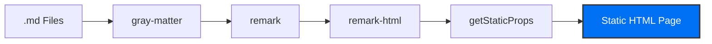

# 🚀 Next.js Blog: Architectural Implementation

This project is a high-performance static blog platform built as part of the [Official Next.js Learn Course (Pages Router)](https://nextjs.org/learn/pages-router). It serves as a practical implementation of core framework features, enhanced with **custom serverless logic** and **dynamic interactive components**.

🔗 **Live Demo:** [https://nextjs-blog-example.vercel.app](https://nextjs-blog-example.vercel.app)

---

## ✨ Features at a Glance
* 🚀 **Static Site Generation (SSG)** — Pre-rendered pages for perfect SEO and speed.
* 🛣️ **Dynamic Routing (`[id].js`)** — Scalable content structure based on file IDs.
* 📑 **Markdown Pipeline** — Automated transformation from raw `.md` to HTML.
* ⚡ **Serverless API Route** — Custom backend endpoint for dynamic quote generation.
* 🖼️ **Asset Optimization** — High-performance images and pre-fetched navigation.

---

## 🛠 Tech Stack

* **Framework:**  **Next.js (Pages Router)**
* **Library:**  **React (Hooks & Components)**
* **Language:**  **JavaScript (ES6+)**
* **Styling:**  **CSS Modules**
* **Deployment:**  **Vercel**

---

## ✨ Key Features
- **Static Site Generation (SSG):** All blog posts are pre-rendered at build time for maximum performance and SEO.
- **Dynamic Inspiration Engine:** Integrated a custom API route with React hooks for real-time interactivity.
- **Reactive UI Theming:** Data-driven styling that updates the interface dynamically based on API responses.
- **Optimized Assets:** Automatic image optimization (`next/image`) and intelligent link prefetching (`next/link`).
- **Markdown Pipeline:** Professional content transformation from raw `.md` files to structured HTML.

---

## ⚙️ Architecture / Data Flow
The blog generation follows a strictly defined architectural pipeline:


## ⚡ Custom Feature: Quote API Engine
- I extended the core functionality to demonstrate full-stack capabilities and state management:

- Serverless API Endpoint: pages/api/quote.js acts as a microservice serving randomized quotes in JSON format.

- React Hooks Integration: Uses useState for local state management and useEffect for data fetching orchestration on component mount.

- Dynamic Styling: Demonstrates advanced CSS-in-JS patterns where background colors update in real-time with smooth transitions.

---

## 💡 Developer Insights
- Why SSG? I utilized getStaticProps to ensure perfect SEO and near-zero loading times, which is critical for blog platforms.

- Scalability: By using getStaticPaths, the blog can scale to hundreds of posts automatically without manual route configuration.

- API Design: The JSON-first API approach ensures a clean separation between data (Backend) and presentation (Frontend).

- Tooling: Implemented gray-matter and remark to create a decoupled content management system within the repository.

---

## 🏗 Project Architecture
```text
├── components/     # Reusable UI components (Layout, Date, etc.)
├── lib/            # Shared logic for Markdown & filesystem processing
├── pages/          # File-based routing and API Endpoints
│   ├── api/        # Serverless backend logic (JSON endpoints)
│   └── posts/      # Dynamic blog post segments ([id].js)
├── posts/          # Content storage (Markdown files)
└── styles/         # Global styles and CSS Modules
```

## 🚀 Getting Started
## 1. Install dependencies
```text
npm install
```
## 2. Run development server
```text
npm run dev
```
## 3. Build for production
```text
npm run build
```
---
## 🎓 Learning Outcomes
* Architecting applications using Next.js Pages Router.

* Managing Dynamic Routing and nested layouts.

* rocessing local filesystems with Node.js in a server-side context.

* Integrating Serverless API Routes with React state management.

* Optimizing web performance through Code Splitting and CDN Caching.

---

